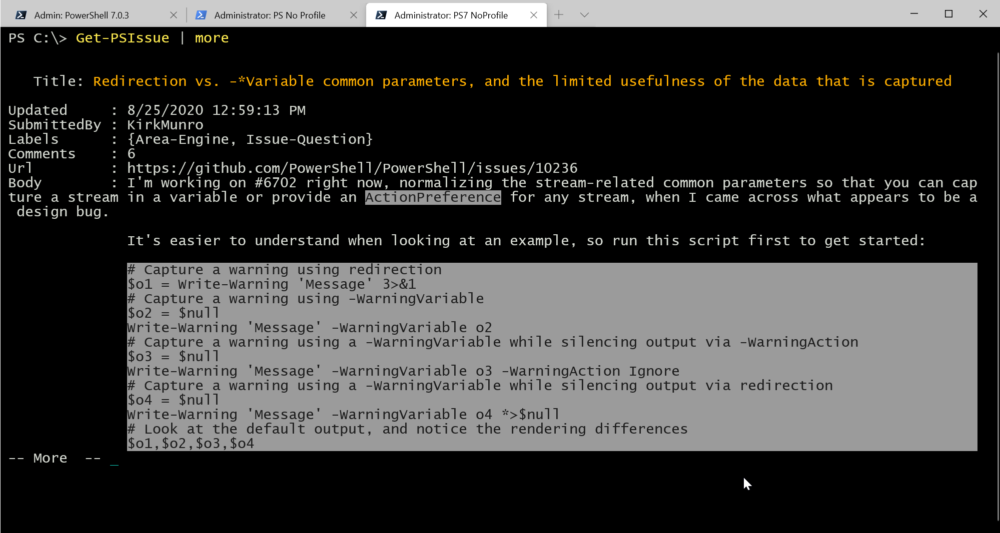
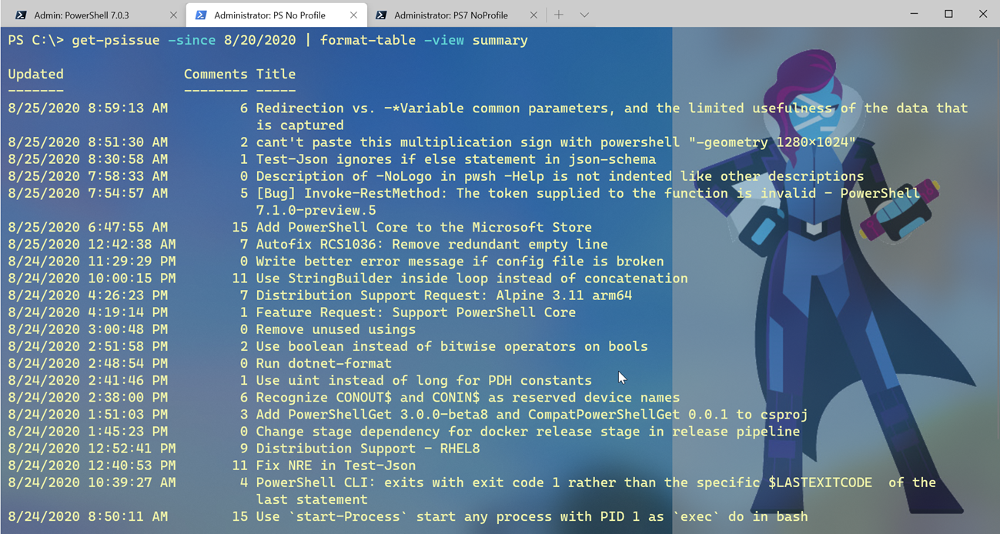

# PSReleaseTools

[](https://www.powershellgallery.com/packages/PSReleaseTools/) [](https://www.powershellgallery.com/packages/PSReleaseTools/)

<p align="left"></p>

This PowerShell module provides a set of commands for working with the latest releases from the [PowerShell GitHub repository](https://github.com/PowerShell/PowerShell). The module contains commands to get summary information about the most current PowerShell version as well as functions to download some or all of the release files or install the latest stable and/or preview build of PowerShell.

These commands utilize the GitHub API, which is subject to rate limits. It is recommended that you save results of commands like `Get-PSReleaseAsset` to a variable. If you encounter an error message for `Invoke-RestMethod` like "Server Error" then you have likely exceeded the API limit. You will need to wait a bit and try again. _*You do not need to have or use a GitHub account to use these commands.*_

This module should work cross-platform on both Windows PowerShell 5.1 and PowerShell 7.x, but is primarily intended for Windows platforms.

You can install this module from the PowerShell Gallery.

```powershell
Install-Module PSReleaseTools
```

## The Module

The module currently has 9 commands:

- [Get-PSReleaseCurrent](Docs/Get-PSReleaseCurrent.md)
- [Get-PSReleaseSummary](Docs/Get-PSReleaseSummary.md)
- [Get-PSReleaseAsset](Docs/Get-PSReleaseAsset.md)
- [Save-PSReleaseAsset](Docs/Save-PSReleaseAsset.md)
- [Install-PowerShell](Docs/Install-PowerShell.md)
- [Install-PSPreview](Docs/Install-PSPreview.md)
- [Get-PSIssue](Docs/Get-PSIssue.md)
- [Get-PSIssueLabel](Docs/Get-PSIssueLabel.md)
- [Open-PSIssue](Docs/Open-PSIssue.md)

All of the functions take advantage of the [GitHub API](https://developer.github.com/v3/ "learn more about the API") which in combination with either [Invoke-RestMethod](http://go.microsoft.com/fwlink/?LinkID=217034 "read online help for the cmdlet") or [Invoke-WebRequest](http://go.microsoft.com/fwlink/?LinkID=217035  "read online help for the cmdlet"), allow you to programmatically interact with GitHub.

### Get Current Release

The first command, `Get-PSReleaseCurrent` can provide a quick summary view of the latest stable or preview release.

```powershell
PS C:\> Get-PSReleaseCurrent

Name                                   OnlineVersion       Released                    LocalVersion
----                                   -------------       --------                    ------------
v7.1.0 Release of PowerShell           7.1.0               11/11/2020 4:23:08 PM              7.1.0
```

The command writes a custom object to the pipeline which has additional properties.

```powershell
PS C:\> Get-PSReleaseCurrent -preview | Select-Object *

Name         : v7.2.0-preview.2 Release of PowerShell
Version      : v7.2.0-preview.2
Released     : 12/15/2020 9:31:39 PM
LocalVersion : 7.1.0
URL          : https://github.com/PowerShell/PowerShell/releases/tag/v7.2.0-preview.2
Draft        : False
Prerelease   : True
```

### Summary Information

`Get-PSReleaseSummary` queries the PowerShell repository release page and constructs a text summary. You can also have the command write the report text as markdown.


I put the release name and date right at the top so you can quickly check if you need to download something new. In GitHub, each release file is referred to as an *asset*. The `Get-PSReleaseAsset` command will query GitHub about each file and write a custom object to the pipeline.

```powershell
PS C:\> Get-PSReleaseAsset

FileName      : powershell-7.1.0-1.centos.8.x86_64.rpm
Family        : CentOS
Format        : rpm
SizeMB        : 65
Hash          : F3985B24719534F27A6C603416C7644771E17C75AFBFD8E6D5E98390045BF9D3
Created       : 11/10/2020 8:08:04 PM
Updated       : 11/10/2020 8:08:06 PM
URL           : https://github.com/PowerShell/PowerShell/releases/download/v7.1.0/powershell-7.1.0-1.centos.8.x86_64.rpm
DownloadCount : 10509
...
```

By default, the command will display assets for all platforms, but I added a `-Family` parameter if you want to limit yourself to a single entry like MacOS.

```powershell
PS C:\> Get-PSReleaseAsset -Family MacOS

FileName      : powershell-7.1.0-osx-x64.pkg
Family        : MacOS
Format        : pkg
SizeMB        : 63
Hash          : 9B7397266711B279B5413F42ABC899730539C8D78A29FD116E19A1BB78244D78
Created       : 11/10/2020 8:08:18 PM
Updated       : 11/10/2020 8:08:20 PM
URL           : https://github.com/PowerShell/PowerShell/releases/download/v7.1.0/powershell-7.1.0-osx-x64.pkg
DownloadCount : 47202

FileName      : powershell-7.1.0-osx-x64.tar.gz
Family        : MacOS
Format        : gz
SizeMB        : 63
Hash          : 10CE8B2837F30F127F866E9680F518B9AA6288222C24B62AD1CAD868FB2A66E9
Created       : 11/10/2020 8:08:21 PM
Updated       : 11/10/2020 8:08:26 PM
URL           : https://github.com/PowerShell/PowerShell/releases/download/v7.1.0/powershell-7.1.0-osx-x64.tar.gz
DownloadCount : 3657
...
```

Of course, you will want to download these files, which is the job of the last command. By default, `Get-PSReleaserAsset` will save all files to the current directory unless you specify a different path. You can limit the selection to a specific platform with the `-Family` parameter, which uses a validation set.

```powershell
PS C:\> Save-PSReleaseAsset -Family Ubuntu -Path D:\Temp -WhatIf
What if: Performing the operation "Downloading https://github.com/PowerShell/PowerShell/releases/download/v7.1.0/powershell_7.1.0-1.ubuntu.16.04_amd64.deb" on target "D:\temp\powershell_7.1.0-1.ubuntu.16.04_amd64.deb".
What if: Performing the operation "Downloading https://github.com/PowerShell/PowerShell/releases/download/v7.1.0/powershell_7.1.0-1.ubuntu.18.04_amd64.deb" on target "D:\temp\powershell_7.1.0-1.ubuntu.18.04_amd64.deb".
What if: Performing the operation "Downloading https://github.com/PowerShell/PowerShell/releases/download/v7.1.0/powershell_7.1.0-1.ubuntu.20.04_amd64.deb" on target "D:\temp\powershell_7.1.0-1.ubuntu.20.04_amd64.deb".
```

You can select multiple names. If you choose Windows, there is a dynamic parameter called `-Format` where you can select ZIP or MSI. `Save-PSReleaseAsset` supports `-WhatIf`.

I also realized you might run `Get-PSReleaseAsset`, perhaps to examine details before downloading. Since you have those objects, why not be able to pipe them to the save command?

```powershell
PS C:\> Get-PSReleaseAsset -Family Rhel  | Save-PSReleaseAsset -Path D:\Temp -Passthru


    Directory: D:\Temp


Mode                 LastWriteTime         Length Name
----                 -------------         ------ ----
-a----         1/13/2021  11:13 AM       67752949 powershell-7.1.0-1.rhel.7.x86_64.rpm
```

The current version of this module uses regular expression named captures to pull out the file name and corresponding SHA256 hashes. The save command then calls [Get-FileHash](https://docs.microsoft.com/powershell/module/microsoft.powershell.utility/get-filehash?view=powershell-5.1&WT.mc_id=ps-gethelp "read online help for the cmdlet") to get the current file hash and compares them.

### Installing a Build

On Windows, it is pretty easy to install a new build with a one-line command:

```powershell
Get-PSReleaseAsset -Family Windows -Only64Bit -Format msi |
Save-PSReleaseAsset -Path d:\temp -Passthru | Invoke-Item
```

Or you can use one of two newer functions to install the latest 64bit release. You can specify the interaction level.

 [Install-PSPreview](/Docs/Install-PSPreview.md) will download the latest 64-bit _*preview*_ build for Windows and kick off the installation.

 ```powershell
Install-PSPreview -Mode Passive
 ```

 [Install-PowerShell](/Docs/Install-PowerShell.md) will do the same thing but for the latest stable release. The command retains `Install-PSCore` as an alias.

```powershell
Install-PowerShell -Mode Quiet -EnableRemoting -EnableContextMenu -EnableRunContext
```

The functionality of these commands could have been combined, but I decided to leave them as separate commands, so there is no confusion about what you are installing. In both cases, an installation log file will be created at `$env:TEMP\PS7Install.log`.

Non-Windows platforms have existing command-line installation tools that don't need to be replaced. Plus, I don't have the resources to develop and test installation techniques for all of the non-Windows options. That is why install-related commands in this module are limited to Windows.

### Preview Builds

Beginning with v0.8.0 of this module, command functions have a `-Preview` parameter, which will get the latest preview build. Otherwise, the commands will use the latest stable release.

### PowerShell Repository Issues

A new set of commands have been introduced in [v1.8.0](https://github.com/jdhitsolutions/PSReleaseTools/releases/tag/v1.8.0 "see release 1.8.0"). These commands are intended to make it easier for you to look at [issues from the PowerShell GitHub repository](https://github.com/PowerShell/PowerShell/issues). The idea is that you can take a peek at open issues from your PowerShell session and then open the issue in your browser to learn more or contribute.

#### Get-PSIssue

`Get-PSIssue` is intended to get open PowerShell issues from Github. With no parameters, you can get the 25 most recent issues. Use the `-Count` parameter to increase that value using one of the possible values. The actual number of issues returned may vary depending on the rest of your command and how GitHub pages results.

You can also fine-tune your search to get issues that have been updated since a given date. Finally, you can also limit your search to issues tagged with a specific label.



The function writes a custom object to the pipeline and includes a default formatted view. If you are running PowerShell 7, the issue body will be rendered as markdown.

Here is another way you might use the command.



__Note:__ The _PSIssue_ commands use the GitHub API and anonymous connections. The API has rate limits. If you run one of these commands excessively in a short period of time, you might see an error about exceeding the rate limit. If this happens, all you can do is wait an hour and try again. You can read more about GitHub rate-limiting [here](https://docs.github.com/en/rest/overview/resources-in-the-rest-api#rate-limiting "read the Github documentation on rate limiting").

#### Get-PSIssueLabel

To make it easier to search for issues based on a label run `Get-PSIssueLabel`. This command will list available labels from the PowerShell repository. However, you most likely won't need to run this command often. When you import the `PSReleaseTools` module, it will create a global variable called `$PSIssueLabel`.

```powershell
PS C:\> $PSIssueLabel

name                         description
----                         -----------
.NET                         Pull requests that update .net code
Area-Build
Area-Cmdlets
Area-Cmdlets-Archive
Area-Cmdlets-Core
Area-Cmdlets-Management
Area-Cmdlets-Utility
Area-Console
Area-DSC
...
```

This variable is used as part of an argument completer for the `Labels` parameter on `Get-PSIssue`.

#### Open-PSIssue

Finally, you may want to respond to an issue. If you run `Open-PSIssue` without any parameters, it should open the Issues section of the PowerShell repository in your browser. Or you can pipe an issue object to the command, as long as you include the `Url` property.

```powershell
Get-PSIssue | Select-Object Updated,Labels,Title,Url | Out-GridView -PassThru | Open-PSIssue
```

There are no plans to add a command to open a new issue from a PowerShell session. You can use `Open-PSIssue` to get to GitHub and then use your browser to submit a new issue.

## Support

If you have suggestions or encounter problems, please post an issue in this GitHub repository. If you find this project useful, or any of my work, please consider a small support donation.

[<kbd>:heart:Sponsor</kbd>](https://paypal.me/jdhitsolutions?locale.x=en_US)

Last Updated 2021-10-15 15:21:21Z
